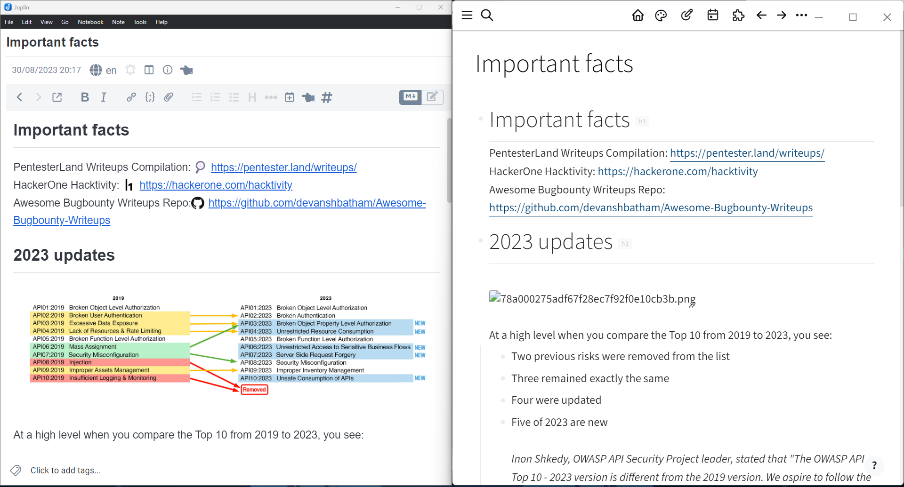
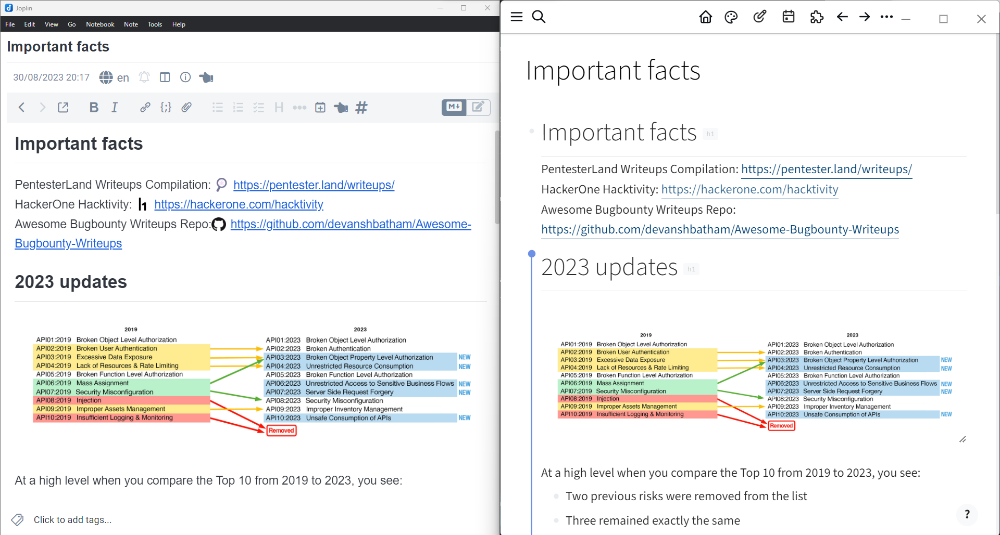

# Joplin-to-Logseq-Integrater
A basic powershell scripts to be used while moveing from Joplin to Logseq!

## Why this?
Ok, while you export notes from [Joplin](https://joplinapp.org/) to [Logseq](https://logseq.com/) as Markdown File! Joplin also transfer all of the image asssets from the notes within a directory named `_resources`, and in the real note files, it alter the images path to be used from `_resources`, but (I think it is a disfunctionality from Logseq) Logseq can't utilize these image file as correctly rendered images inside the note. Logseq use `assets` folder to store the images, and link them. So I create a simple powershell script which reads all the exported md file as plaintext and rename every `_resources`(which was used in image linking) with `assets` which is a Logsec native. So enjoy! this script is fast.

## Usage
Edit your Joplin Exported Folder path inside the script and run, it's good to go!

## Pictures
**Before**

***
**After**

Take it eazy, I use Logseq!

